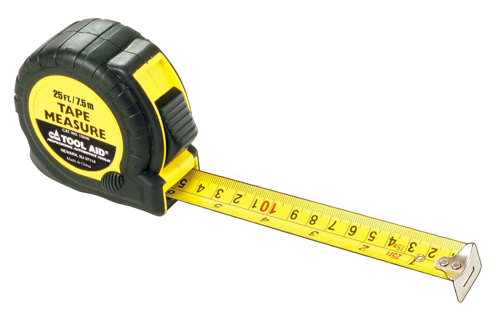
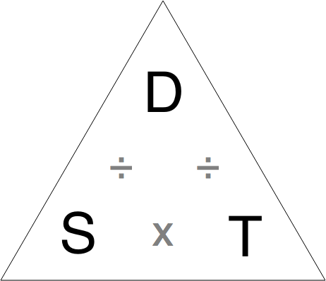

build-lists: true

# Hello

### @PeteJMcFarlane

^ I'm Pete McFarlane, I live in Leeds, and I'm a software engineer, currently working for Inviqa.
Been using PHP for 6 years. Became a developer by accident, started writing wordpress websites, themes and plugins,
gradually became more aware and interested in other frameworks/technologies, design paradigms - Object Oriented
Programming, Design Patterns, TDD, BDD, DDD, Event Sourcing and so on. I'm currently looking at Functional Programming
but that's not what today's talk is entirely about so you can talk to me later about that if you wish.

---

# Simple Made Easy

^ Who likes to look back on old code see how it works?
^ Do you feel proud?
^ Does it confuse you?
^ can you fix bugs easily?
^ is it brittle?
^ leaky (tenuous) abstractions?
^ can you see the domain problems?
^ natural feeling progression
^ good sign - improved - learned new things - new language features - be encouraged!

^ tempting to re-write, especially if it's not your own code

---

# How to write code you won't hate tomorrow
# <:poop:/> 😫:angry:

^ Not exhaustive, but my experiences - some ideas/tips
please ask questions, if something isn't clear or you have suggestions

---

^ mainly talking about

# KISS

---


# KISS

---


# KISS

---

# KISS
## Keep It Simple, Stupid

---



# how do we measure code quality?

---

## how do we measure code quality?

- number of classes
- number of tests
- using latest framework
- PSR compliant
- number of bugs shipped

---

## how do we measure code quality?

can we:

- read it easily
- reason about it clearly
- replace it quickly

^ not only files and layout, but project file structure. Uncle Bob says: Your architectures should tell readers about the system, not about the frameworks you used in your system [*](http://blog.8thlight.com/uncle-bob/2011/09/30/Screaming-Architecture.html)
global state variables, 100 line methods
Successful business change and adapt if there software can. Is the software going to help or hinder?

---

## readable

- small functions/classes
- good names
- avoid nested code (ifs/loops) - extract methods
- avoid `else`
- `return` early or use a guard clause
- avoid negation `!`

^ SRP
refactor names
Ubiquitous language
npath complexity

---

```
$data = $db->query("INSERT LONG, COMPLICATED SQL QUERY HERE");

echo '<ul>';
for ($i = 0; $i < count($data); $i++) {
    echo "<li>$data[$i][0] - $data[$i][1]</li>";
}
echo '</ul>';

```

---

```
$people = $db->query("INSERT LONG, COMPLICATED SQL QUERY HERE");

echo '<ul>';
for ($i = 0; $i < count($people); $i++) {
    echo "<li>$people[$i][0] - $people[$i][1]</li>";
}
echo '</ul>';

```

---

```
$people = $db->query("INSERT LONG, COMPLICATED SQL QUERY HERE");

echo '<ul>';
foreach ($people as $person) {
    echo "<li>$person[0] - $person[1]</li>";
}
echo '</ul>';

```

---

```
$people = $db->query("INSERT LONG, COMPLICATED SQL QUERY HERE");

echo '<ul>';
foreach ($people as $person) {
    echo "<li>{$person['name']} - {$person['email']}</li>";
}
echo '</ul>';

```

---

```
$people = $db->query("INSERT LONG, COMPLICATED SQL QUERY HERE");

$listElements = array_reduce($people, function ($html, $person) {
    return $html . "<li>{$person['name']} - {$person['email']}</li>";
});

return '<ul>' . $listElements . '</ul>';

```

---

```
$people = $db->query("INSERT LONG, COMPLICATED SQL QUERY HERE");

return array_reduce($people, function ($html, $person) {
    return $html . "<li>{$person['name']} - {$person['email']}</li>";
}, '<ul>') . '</ul>;

```

---

```
Input:
 _     _  _     _  _  _  _  _ 
| |  | _| _||_||_ |_   ||_||_|
|_|  ||_  _|  | _||_|  ||_| _|

Output:
"0123456789"
```

---

```
return implode(array_map(function ($char) {
    return $this->translate($char);
}, array_map('implode', transpose(array_map(function ($line) {
    return str_split($line, 3);
}, explode("\n", $ascii))))));
```

---

```
$lines = explode("\n", $ascii);
​
$chunksOf3 = array_map(function ($line) {
    return str_split($line, 3);
}, $lines);
​
$transposed = transpose($chunksOf3);
​
$characters = array_map('implode', $transposed);
​
$numbers = array_map(function ($char) {
    return $this->translate($char);
}, $characters);
​
return implode($numbers);
```

---

```
if ($request->isValid()) {
    $user = $request->getUser();
    if ($user->hasPermissions()) {
        foreach ($request->getUpdates() as $update) {
            if ($update != null) {
                $this->processUpdate($update);
            }
        }
    } else {
        throw new PermissionDeniedException;
    }
} else {
    throw new InvalidRequestException;
}
```

---

```
if (!$request->isValid()) {
    throw new InvalidRequestException;
} else {
    $user = $request->getUser();
    if ($user->hasPermissions()) {
        foreach ($request->getUpdates() as $update) {
            if ($update != null) {
                $this->processUpdate($update);
            }
        }
    } else {
        throw new PermissionDeniedException;
    }
}
```

---

```
if (!$request->isValid()) {
    throw new InvalidRequestException;
}

$user = $request->getUser();
if ($user->hasPermissions()) {
    foreach ($request->getUpdates() as $update) {
        if ($update != null) {
            $this->processUpdate($update);
        }
    }
} else {
    throw new PermissionDeniedException;
}
```

---

```

$this->guardAgainstInvalidRequest($request);

$user = $request->getUser();
if ($user->hasPermissions()) {
    foreach ($request->getUpdates() as $update) {
        if ($update != null) {
            $this->processUpdate($update);
        }
    }
} else {
    throw new PermissionDeniedException;
}
```

---

```

$this->guardAgainstInvalidRequest($request);

$user = $request->getUser();
if (!$user->hasPermissions()) {
    throw new PermissionDeniedException;
}

foreach ($request->getUpdates() as $update) {
    if ($update != null) {
        $this->processUpdate($update);
    }
}
```

---

```

$this->guardAgainstInvalidRequest($request);

$this->guardAuthorisedUser($request->getUser());

foreach ($request->getUpdates() as $update) {
    if ($update != null) {
        $this->processUpdate($update);
    }
}
```

---

```

$this->guardAgainstInvalidRequest($request);

$this->guardAuthorisedUser($request->getUser());

$updates = array_filter($request->getUpdates());

$this->processUpdates($updates);
```

---

> Good code doesn't just emerge by accident
-- Me

---

```
function example()
{
    $data = ...;
    if (!$this->resultIsOK($data)) {
        $result = false;
    } else {
        $result = true;
    }

    return $result;
}
```

---

```
function example()
{
    $data = ...;
    if ($this->resultIsOK($data)) {
        $result = true;
    } else {
        $result = false;
    }

    return $result;
}
```

---

```
function example()
{
    $data = ...;
    if ($this->resultIsOK($data)) {
        return true;
    } else {
        return false;
    }
}
```

---

```
function example()
{
    $data = ...;
    if ($this->resultIsOK($data)) {
        return true;
    }
    return false;
}
```

---

```
function example()
{
    $data = ...;
    return $this->resultIsOK($data) ? true : false;
}
```

---

```
function example()
{
    $data = ...;
    return $this->resultIsOK($data);
}
```

---

## understandable

- small, composable functions - that do one thing
- hide complexity
- good names - variables, functions, namespaces, classes
- small public API
- TDD
- Value objects

^     - relative worth - a particular magnitude, precise meaning or significance
    - can be shared
    - easy to fabricate
    - semantically transparent
    - attract behaviour
- Avoid state - Immutable data structures

---



---

```
<?php

$d = 10;

$t = 3600;

$s = $d / t;

echo $s;

```

---

```
class Distance
{
    private $km;

    private function __construct() {}

    public static function fromKm($km)
    {
        $d = new static;
        $d->km = $km;
        return $d;
    }

    public function asKm()
    {
        return $this->km;
    }
}
```

---

```
class Time
{
    private $seconds;

    private function __construct() {}

    public static function fromSeconds($seconds)
    {
        $t = new static;
        $t->seconds = $seconds;
        return $t;
    }

    public function inHours()
    {
        return $this->seconds / 3600;
    }
}
```

---

```
class Speed
{
    private $kmph;

    public static function fromDistanceAndTime(Distance $d, Time $t)
    {
        $s = new static;
        $s->kmph = $d->asKm() / $t->inHours();
        return $s;
    }

    public function asMph()
    {
        return $this->kmph * 1.6093;
    }
}
```

---


```
<?php

$d = Distance::fromKm(10); // 10 km

$t = Time::fromSeconds(3600); // 1 hr

$s = Speed::fromDistanceAndTime($d, $t); // 10 kmph

echo $s->asMph(); // will print 16.093

```

---

## adaptable

- Things change - new business knowledge/rules, changing technologies
- small functions/classes/modules
- throw away code
- dependency injection
- be abstract, use interfaces

^ - don't go overboard with factories/design patterns (example - injecting date factory)
 - use polymorphism
 - when you only have a hammer everything becomes a nail
 - hide complexity and implementation
 - follow language of domain

---

# NO CODE IS SIMPLER THAN NO CODE

---

## Simple enables change = Opportunity

---

- do katas - readable, efficient, flexible
- exercism.io, projecteuler.net
- pair/mob program
- code review
- read others code bases
- mentor at http://phpmentoring.org
- attend/speak conferences & user groups
- write a blog

---


# Goodbye

### @PeteJMcFarlane

^ thanks to Tom, & audience