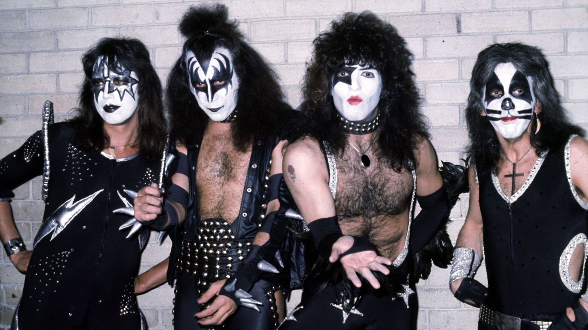

# Hello

### @PeteJMcFarlane

^ I'm Pete McFarlane, I live in Leeds, and I'm a software engineer, currently working for Inviqa.
Been using PHP for 6 years. Became a developer by accident, started writing wordpress websites, themes and plugins,
gradually became more aware and interested in other frameworks/technologies, design paradigms - Object Oriented
Programming, Design Patterns, TDD, BDD, DDD, Event Sourcing and so on. I'm currently looking at Functional Programming
but that's not what todays talk is entirely about so you can talk to me later about that if you wish.

---

# Simple Made Easy

^ Who likes to look back on old code see how it works?
^ Do you feel proud?
^ Does it confuse you?
^ can you fix bugs easily?
^ is it brittle?
^ leaky (tenuous) abstractions?
^ can you see the domain problems?
^ natural feeling progression
^ good sign - improved - learned new things - new language features - be encouraged!

^ tempting to re-write, especially if it's not your own code

---

# How to write code you won't hate
# <:poop:/> 😫:angry:

^ Not exhaustive, but my experiences - some ideas/tips

---

^ mainly talking about

# KISS

---



# KISS

---


# KISS

---

# KISS
## Keep It Simple, Stupid

---


# how do we measure code quality?

---

## how do we measure code quality?

- number of classes
- number of tests
- using latest framework
- PSR compliant
- number of bugs shipped

---

## how do we measure code quality?

can we:
    - read it easily
    - reason about it clearly
    - replace it quickly

^ not only files and layout, but project file structure. Uncle Bob says: Your architectures should tell readers about the system, not about the frameworks you used in your system [*](http://blog.8thlight.com/uncle-bob/2011/09/30/Screaming-Architecture.html)
avoid large n-path complexity levels, global state variables, 100 line methods
Successful business change and adapt if there software can. Is the software going to help or hinder?

---

## readable

small functions/classes
good names
avoid nested code (ifs/loops) - extract methods
avoid `else`
`return` early or use a guard clause
avoid negation `!`

^ SRP
refactor names
TODO example openhours kata, function isOpen($date);
7 stages of naming things:
Missing
Nonsense
Honest
Honest and Complete
Does the Right Thing
Intent
Domain Abstraction

---

```
$data = $db->query("INSERT LONG, COMPLICATED SQL QUERY HERE");

echo '<ul>';
for ($i = 0; $i < count($data); $i++) {
    echo '<li>$data[$i][0] - $data[$i][1]</li>';
}
echo '</ul>';

```

---

```
$people = $db->query("INSERT LONG, COMPLICATED SQL QUERY HERE");

echo '<ul>';
foreach ($people as $person) {
    echo "<li>{$person['name']} - {$person['email']}</li>";
}
echo '</ul>';

```

---

```
$people = $db->query("INSERT LONG, COMPLICATED SQL QUERY HERE");

$listElements = array_reduce($people, function ($html, $person) {
    return $html . "<li>{$person['name']} - {$person['email']}</li>";
});

return '<ul>' . $listElements . '</ul>';

```

---

```
$people = $db->query("INSERT LONG, COMPLICATED SQL QUERY HERE");

return array_reduce($people, function ($html, $person) {
    return $html . "<li>{$person['name']} - {$person['email']}</li>";
}, '<ul>') . '</ul>;

```

---

```
private function handleBallPotted($state, BallPotted $event)
{
    $ball = $event->getBall();
    $points = $ball->getValue();
    $lastEvent = $state[0];
    $player = $event->getPlayer();

    if ($ball instanceof RedBall) {
        $state[$player] += $points;
    } else {
        if ($lastEvent instanceof BallPotted && $lastEvent->getPlayer() == $player && $lastEvent->getBall() instanceof RedBall) {
            $state[$player] += $points;
        } else {
            if ($player == 1) {
                $state[2] += max(4, $points);
            } else {
                $state[1] += max(4, $points);
            }
        }
    }

    return $state;
}
```

---

```
private function handleBallPotted($state, BallPotted $event)
{
    ...
    if ($ball instanceof RedBall) {
        ...
    } else {
        if ($lastEvent instanceof BallPotted
            && $lastEvent->getPlayer() == $player
            && $lastEvent->getBall() instanceof RedBall
        ) {
            ...
        } else {
            ...
        }
    }
    ...
}
```

---

```
private function playerPreviouslyPottedRedBall($lastEvent, $currentPlayer)
{
    return $lastEvent instanceof BallPotted
        && $lastEvent->byPlayer() == $currentPlayer
        && $lastEvent->getBall() instanceof RedBall;
}
```

---

```
private function handleBallPotted($state, BallPotted $event)
{
    ...
    if ($ball instanceof RedBall) {
        ...
    } else {
        if ($this->playerPreviouslyPottedARedBall($lastEvent, $player)) {
            ...
        } else {
            ...
        }
    }
    ...
}
```

---

```
private function handleBallPotted($state, BallPotted $event)
{
    ...
    if ($ball instanceof RedBall) {
        $state[$player] += $points;
    } else {
        if ($this->playerPreviouslyPottedARedBall($lastEvent, $player)) {
            $state[$player] += $points;
        } else {
            if (...) {
                ...
            } else {
                ...
            }
        }
    }
    ...
}
```

---

```
private function handleBallPotted($state, BallPotted $event)
{
    ...
    if ($ball instanceof RedBall) {
        $state[$player] += $points;
    } elseif ($this->playerPreviouslyPottedARedBall($lastEvent, $player)) {
        $state[$player] += $points;
    } else {
        if (...) {
            ...
        } else {
            ...
        }
    }
    ...
}
```
---

```
private function handleBallPotted($state, BallPotted $event)
{
    ...
    if ($ball instanceof RedBall || $this->playerPreviouslyPottedARedBall($lastEvent, $player)) {
        $state[$player] += $points;
    } else {
        if (...) {
            ...
        } else {
            ...
        }
    }
    ...
}
```

---

```
private function handleBallPotted(Score $currentScore, BallPotted $ballPotted, $lastEvent)
{
    $points = $ballPotted->getBall()->getValue();
    $player = $ballPotted->byPlayer();

    if ($ballPotted->isRed() || $this->playerPreviouslyPottedRedBall($lastEvent, $player)) {
        return $currentScore->awardPointsToPlayer($points, $player);
    }

    return $currentScore->awardPointsToOpponent(max(4, $points), $player);
}
```

---

```
<?php

function example()
{
    $data = ...;
    if (!$this->resultIsOK($data)) {
        $result = false;
    } else {
        $result = true;
    }

    return $result;
}
```

---

```
<?php

function example()
{
    $data = ...;
    if ($this->resultIsOK($data)) {
        $result = true;
    } else {
        $result = false;
    }

    return $result;
}
```

---

```
<?php

function example()
{
    $data = ...;
    if ($this->resultIsOK($data)) {
        return true;
    } else {
        return false;
    }
}
```

---

```
<?php

function example()
{
    $data = ...;
    if ($this->resultIsOK($data)) {
        return true;
    }
    return false;
}
```

---

```
<?php

function example()
{
    $data = ...;
    return $this->resultIsOK($data) ? true : false;
}
```

---

```
<?php

function example()
{
    $data = ...;
    return $this->resultIsOK($data);
}
```

---

## understandable

small, composable functions - that do one thing
hide complexity
good names - variables, functions, namespaces, classes
small public API
TDD
Value objects
Avoid state - Immutable data structures

^     - relative worth - a particular magnitude, precise meaning or significance
    - can be shared
    - easy to fabricate
    - semantically transparent
    - attract behaviour

---


---

```
<?php

$d = Distance::fromKm(10); // 10 km

$t = Time::fromSeconds(3600); // 1 hr

$s = Speed::fromDistanceAndTime($d, $t); // 10 kmph

echo $s->asMph(); // will print 16.093

```

---

```
class Distance
{
    private $km;

    private function __construct() {}

    public static function fromKm($km)
    {
        $d = new static;
        $d->km = $km;
        return $d;
    }

    public function getKm()
    {
        return $this->km;
    }
}
```

---

```
class Time
{
    private $seconds;

    private function __construct() {}

    public static function fromSeconds($seconds)
    {
        $t = new static;
        $t->seconds = $seconds;
        return $t;
    }

    public function getHours()
    {
        return $this->seconds / 3600;
    }
}
```

---

```
class Speed
{
    private $kmph;

    public static function fromKmph($kmph)
    {
        $s = new static;
        $s->kmph = $kmph;
        return $s;
    }

    public function asMph()
    {
        return $this->kmph * 1.6093;
    }
}
```

---

```
class Speed
{
    private $kmph;

    public static function fromDistanceAndTime(Distance $d, Time $t)
    {
        $s = new static;
        $s->kmph = $d->getKm() / $t->getHours();
        return $s;
    }

    public function asMph()
    {
        return $this->kmph * 1.6093;
    }
}
```

---


```
<?php

$d = Distance::fromKm(10); // 10 km

$t = Time::fromSeconds(3600); // 1 hr

$s = Speed::fromDistanceAndTime($d, $t); // 10 kmph

echo $s->asMph(); // will print 16.093

```

---

## adaptable

Things change - new business knowledge/rules, changing technologies
small functions/classes/modules
throw away code
dependency injection
NO CODE IS SIMPLER THAN NO CODE
be abstract, use interfaces

^- don't go overboard with factories/design patterns (example - injecting date factory)
 - use polymorphism
 - when you only have a hammer everything becomes a nail
 - hide complexity and implementation
 - follow language of domain
---

## Simple enables change = Opportunity

---

do katas - readable, efficient, flexible
exercism.io
Pair program
code review
read others code bases
mentor http://phpmentoring.org
conferences
user groups
write a blog

